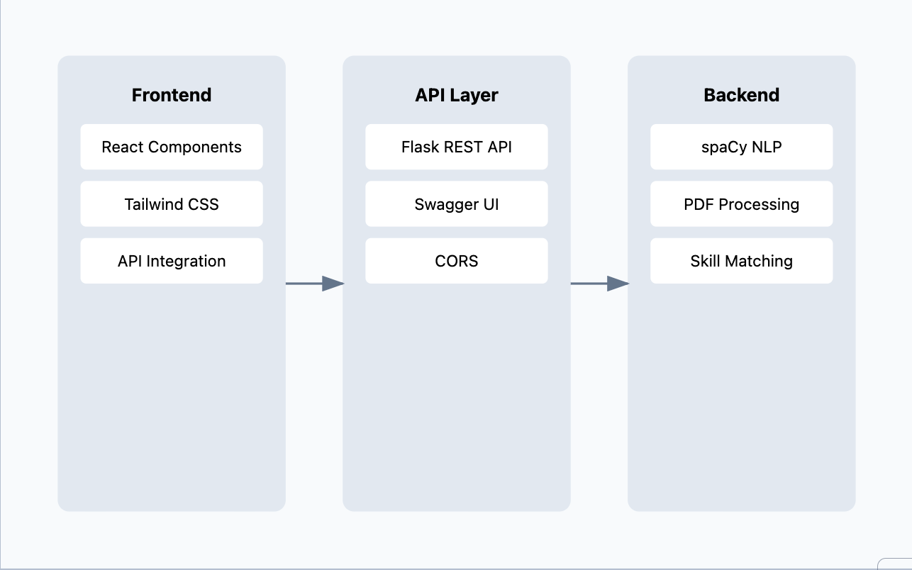
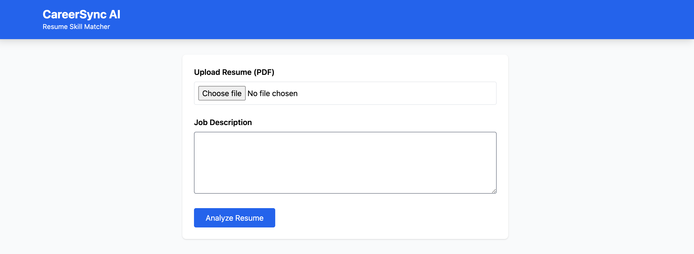
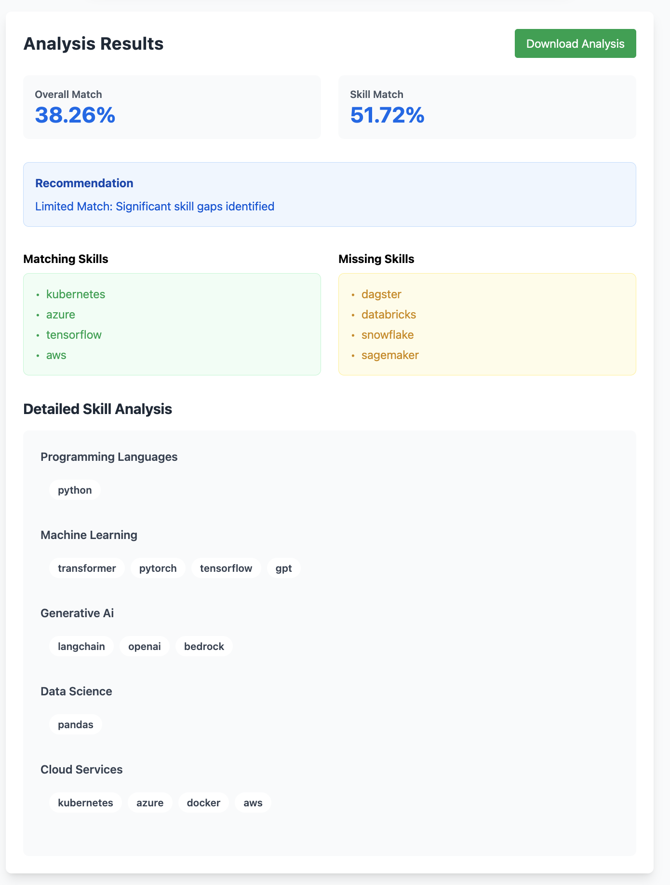

# CareerSync AI - Resume Skill Matcher

AI-powered resume analysis tool that matches resumes against job descriptions using NLP.

```
flowchart TD;
    subgraph "Frontend (React + Tailwind CSS)"
        UI[User Interface]
    end
    subgraph "API Layer (Flask + Swagger)"
        API[Flask API Server] -->|Handles requests| Analyzer[Resume Analyzer]
        API -->|Swagger UI| Docs[API Documentation]
    end
    subgraph "Backend (NLP + Machine Learning)"
        NLP[spaCy NLP Processor] -->|Extracts skills| Matcher[Resume-Job Matcher]
        Matcher -->|Calculates similarity| Scoring[Scoring Engine]
        Scoring -->|Returns match %| Response[API Response]
    end
    subgraph "Storage & Processing"
        PDFParser[PDF Text Extractor] -->|Extracts text| NLP
        SkillsDB[Skills Data JSON] -->|Loads patterns| NLP
        TempStorage[Temporary Storage] -->|Stores uploaded files| PDFParser
    end
    subgraph "Client Interaction"
        UI -->|Sends resume & job description| API
        Response -->|Returns analysis result| UI
    end
    API -.->|Logs requests| Logs[Logging System]

```

## Features
- PDF resume parsing and analysis
- Job description matching
- Categorized skill extraction and scoring
- Detailed recommendations
- Analysis report downloads
- Interactive UI with real-time feedback

## Project Architecture
```
Frontend (React + Tailwind CSS) <-> API (Flask + Swagger) <-> Backend (spaCy NLP)
```


## Tech Requirements
- Python 3.8+
- Node.js 14+
- npm/yarn

## Installation

### Backend Setup
```bash
cd backend
python -m venv venv
source venv/bin/activate  # Windows: venv\Scripts\activate
pip install -r requirements.txt
python -m spacy download en_core_web_sm
```

### Frontend Setup
```bash
cd frontend
npm install
```

### Environment Setup
Create `.env` in frontend directory:
```
REACT_APP_API_URL=http://localhost:5000/api/v1
```

## Project Structure
```
careersync-ai/
├── backend/
│   ├── app.py                # Flask API
│   ├── requirements.txt      # Python dependencies
│   └── skills_data.json     # Skill patterns and weights
├── frontend/
│   ├── public/              # Static assets
│   ├── src/
│   │   ├── components/      # React components
│   │   ├── App.jsx         # Main app component
│   │   └── index.js        # Entry point
│   ├── .env                # Environment variables
│   └── package.json        # Node dependencies
└── README.md
```

## Running the Application

### Backend
```bash
cd backend
python app.py
# Swagger UI: http://localhost:5000/swagger
```

### Frontend
```bash
cd frontend
npm start
# Access: http://localhost:3000
```

## API Documentation

### POST /api/v1/analyze
Analyzes resume against job description.

Request:
- Method: POST
- Content-Type: multipart/form-data
- Body:
  - resume: PDF file
  - job_description: string

Response:
```json
{
  "status": "success",
  "timestamp": "2024-12-31T12:00:00Z",
  "analysis": {
    "overall_match": 75.5,
    "skill_match": 80.0,
    "matching_skills": ["python", "react"],
    "missing_skills": ["aws"],
    "recommendation": "Strong Match"
  }
}
```

## UI Documentation







## Contributing
1. Fork repository
2. Create feature branch
3. Commit changes
4. Push to branch
5. Open pull request

## License
MIT

## Support
For support, email amarnathagowdat@gmail.com